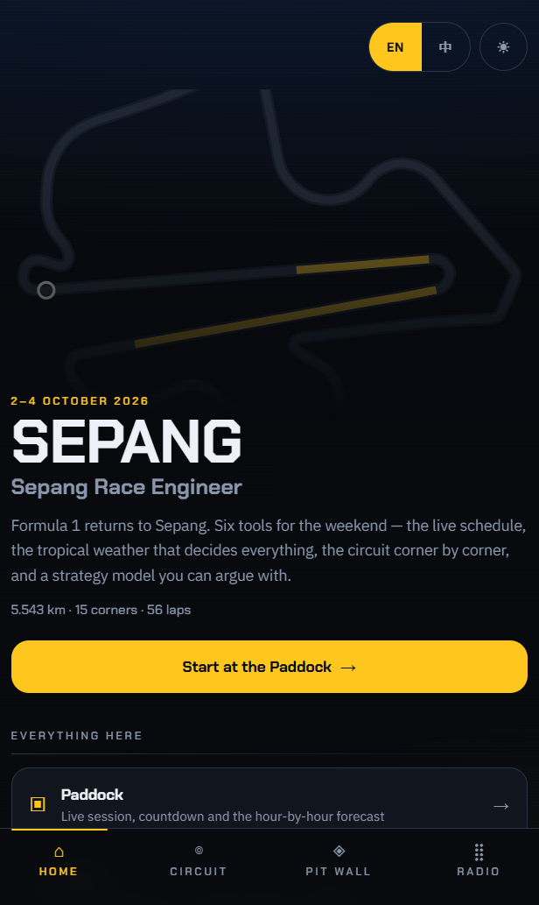
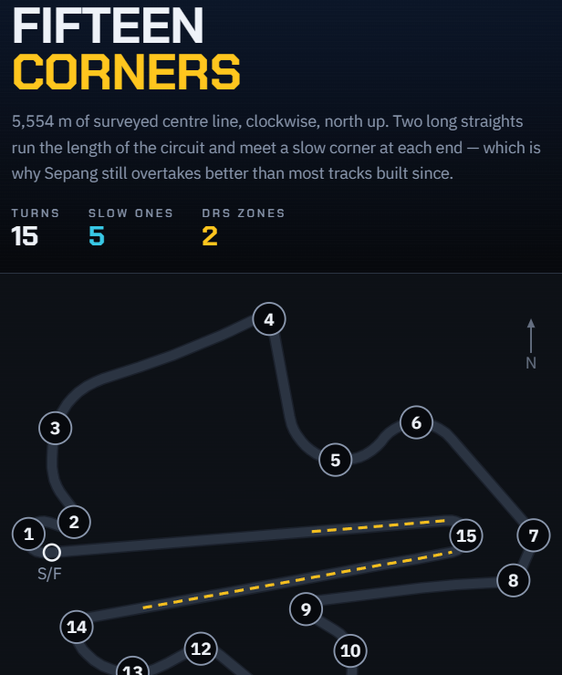
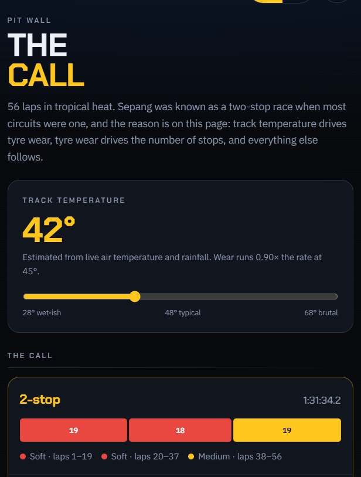

# 雪邦赛车工程师 · Sepang Race Engineer

一个非官方的 F1 雪邦周末随身工具 —— 2026 年巴林大奖赛，在马来西亚举办，**2026 年 10 月 2–4 日**。

**在线地址：https://sepang-race-engineer.vercel.app**

[English](README.md) · 中文

<table>
  <tr>
    <td width="33%"></td>
    <td width="33%"></td>
    <td width="33%"></td>
  </tr>
  <tr>
    <td align="center"><sub>主页</sub></td>
    <td align="center"><sub>赛道 —— 15 个弯，1:1</sub></td>
    <td align="center"><sub>维修站墙 —— 模型的决策</sub></td>
  </tr>
</table>

中英双语、深浅双主题，两者都在**服务端**根据 cookie 决定，所以不会闪出错误的语言或错误的底色。

## 它能做什么

| 路由 | 是什么 |
| --- | --- |
| `/` | **主页** —— 这是什么，以及通往六件工具的入口。首次访问会有四步引导；如果链接带着分享卡或演示时间戳，引导会自动让路。 |
| `/paddock` | **围场** —— 这个周末现在进行到哪：正在跑的场次或下一场的倒计时、逐小时热带天气，以及由此推出的一条建议。 |
| `/track` | **赛道** —— 15 个弯全部按实测坐标 1:1 绘制。每个弯讲透一个 F1 概念。 |
| `/pitwall` | **维修站墙** —— 一个完全透明的轮胎模型。每一个常数都印在页面上；策略是**搜出来的**，不是写死的。 |
| `/archive` | **历史档案** —— 1999–2017 年雪邦举办的全部 19 场马来西亚大奖赛，以及一份由真实成绩自动生成的测验。 |
| `/predict` | **赛前预测** —— 关于这场比赛的五个判断，每一条都对照那 19 场比赛的真实概率定价。可以生成链接分享。 |
| `/visit` | **到场攻略** —— 该坐哪个看台（结合实时天气权衡），以及怎么到达。 |
| `/api/radio` | **车队无线电** —— 回答自由提问。数字由规则引擎算，模型只负责措辞。 |

## 代码围绕的两个想法

**不告诉模型答案。** `src/lib/strategy.ts` 里的轮胎模型只拿到圈速、衰减率和进站损失，然后在 `(圈数, 停站次数, 配方)` 上搜索代价最小的一场比赛。**没有人告诉过它雪邦是两停赛道** —— 它自己推出 30 °C 一停、38–52 °C 两停、58 °C 以上三停。测试钉的是**性质**（「温度更高，进站次数绝不能变少」）而不是具体答案，这样模型仍然有机会以测试没预料到的方式做对。

**规则拥有数字，LLM 只负责措辞。** `/api/radio` 在服务端算出每一个事实，再作为上下文交给模型。下面还垫着一层模板地板 —— 没有 API key、没有额度、断网的情况下，这个功能依然答得正确。

## 数据与署名

这里没有任何东西是从官方抓来的，也没有任何东西伪装成官方产品。

- **赛道几何** —— [OpenStreetMap](https://www.openstreetmap.org/copyright) way 23410503 与 144359489，© OpenStreetMap contributors，ODbL 协议。闭合环线实测 5554 m，对照官方 5543 m（误差 0.2 %）。
- **弯角特性** —— [Driver61 的雪邦指南](https://driver61.com/circuit-guide/sepang/)。
- **尺寸与弯角命名** —— [Wikipedia](https://en.wikipedia.org/wiki/Sepang_International_Circuit)。
- **比赛成绩** —— [Jolpica-F1](https://github.com/jolpica/jolpica-f1)，Ergast 的继任者。
- **天气** —— [Open-Meteo](https://open-meteo.com/)，无需 key，缓存 10 分钟。

**未使用任何 F1、FIA 或赛道方的标识、logo 与图像。**票价一律不转载 —— 价格会变，而一个过期的价格比没有价格更糟。凡是主办方尚未公布的信息（停车、接驳、闸口），应用会明说「尚未公布」，而不是编一个。

## 本地运行

```bash
npm install
npm run dev     # http://localhost:3000
npm test        # 65 个测试，node:test，无测试框架
npm run build
```

任何页面加上 `?t=2026-10-04T15:30` 就能看到比赛进行中的样子 —— 所有与时间相关的文案都是这么验证的。

### 车队无线电

自由提问需要 Anthropic key：

```bash
npx vercel env add ANTHROPIC_API_KEY production
```

不配置它，接口会返回规则引擎的模板 —— 答案依然正确，只是不会说人话。**这种降级是刻意设计的，并且有测试覆盖。**

## 技术栈

Next.js 16（App Router）、React 19、Tailwind CSS v4、TypeScript，部署在 Vercel。没有状态管理库、没有组件库、没有图表库 —— 所有 SVG 都直接从坐标画出来。
